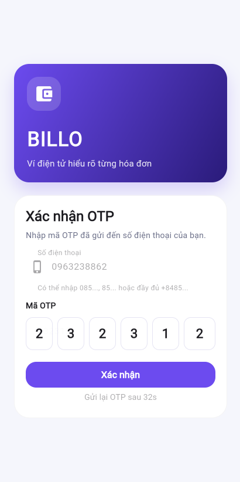
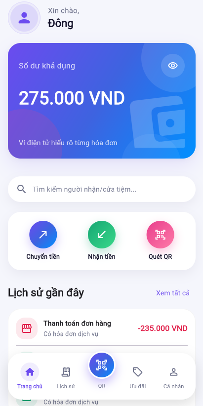
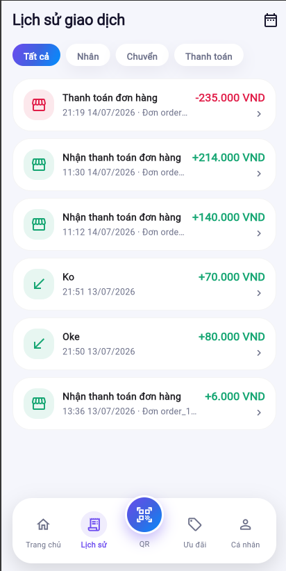
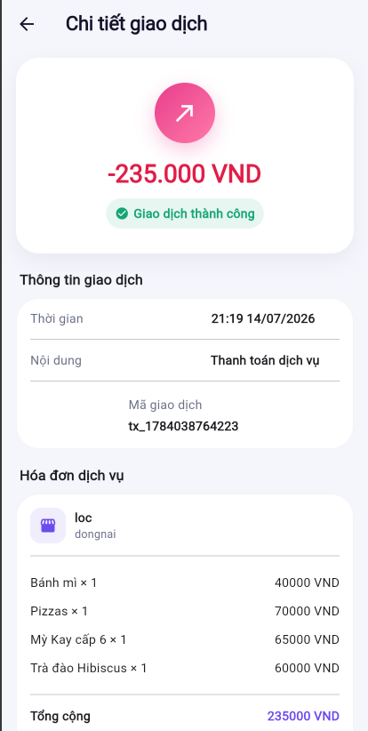
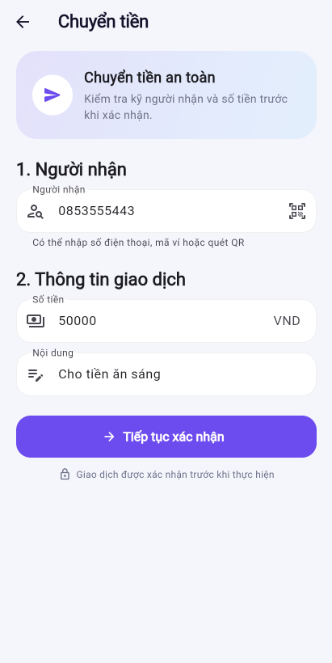
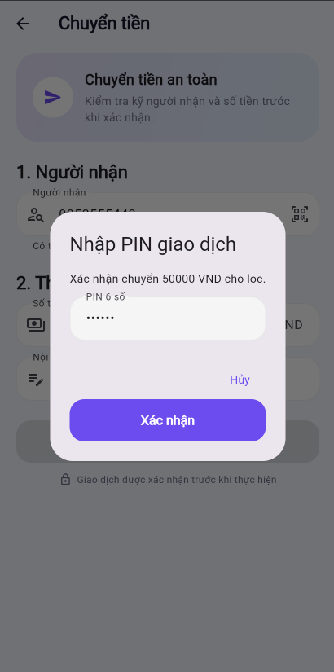
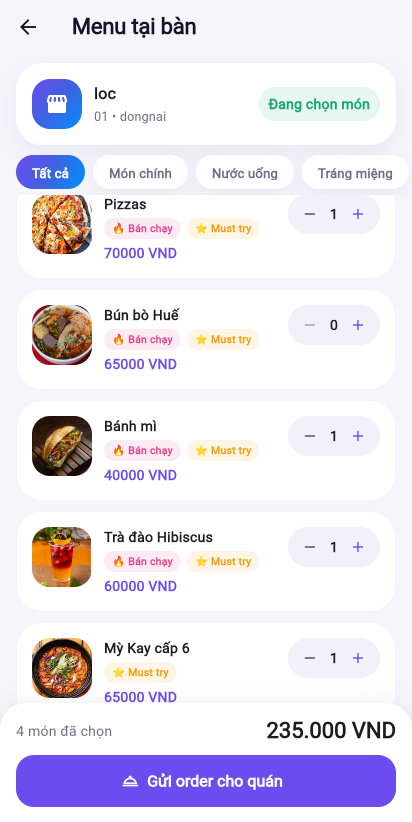
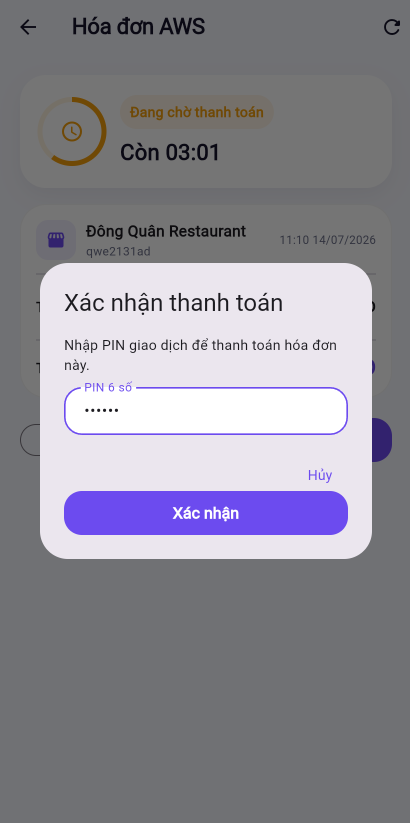
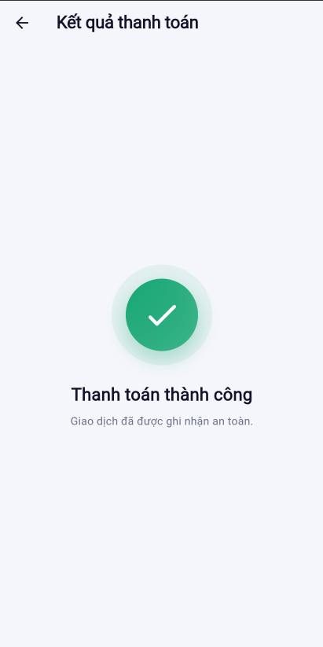
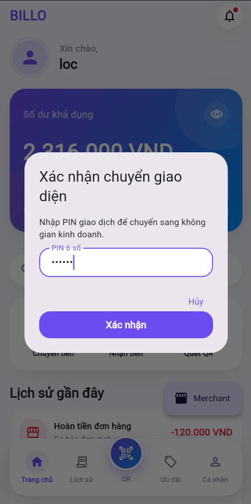

---

This section describes in detail each functionality designed for the Customer role in AWS BILLO, complete with actual operational steps, expected results, and illustrative screenshots from the deployed demo at https://dev.d28z1hw6wfvjzy.amplifyapp.com.

---

## 1. Registration / Login

Customers register their accounts using a phone number and password, then verify via OTP using Amazon Cognito's SMS mechanism.

Operational steps:

- Open the registration screen on the Flutter app.
- Enter the phone number (e.g., `0853555443`, which the system automatically formats to `+84853555443`).
- Enter the password.
- Receive the OTP verification code via SMS.
- Input the OTP to confirm and verify the account.
- Log in using the newly created account.

Image: Customer Registration/Login Screen

Expected results:

- The user is successfully created in Amazon Cognito with a `CONFIRMED` status.
- A user profile and simulated wallet are provisioned in DynamoDB.
- The application redirects the user to the Customer dashboard upon successful login.

Related components: Amazon Cognito (OTP dispatch via SMS, utilizing Amazon SNS SMS infrastructure under the hood).

---

## 2. Set Transaction PIN

Upon logging in for the first time, Customers are required to set a 6-digit transaction PIN to authorize any financial operations.

Operational steps:

- Go to the **Cá nhân** (Profile) tab.
- Select **Đặt PIN giao dịch** (Set Transaction PIN).
- Enter a 6-digit PIN (e.g., `123456`).
- Confirm the PIN.
- Save the configuration.

Image: Transaction PIN Setup Screen

Expected results:

- The PIN will be strictly required for all subsequent financial operations: transferring funds, making QR payments, and toggling between the Merchant and Customer interfaces (see Section 7).

Related components: DynamoDB Main Table. The transaction PIN is securely hashed and stored within the user's profile record in DynamoDB, rather than being stored directly in Cognito.

---

## 3. Wallet and Transaction History

Customers can check their current wallet balance and review the history of all transactions they have performed.

Operational steps:

- Navigate to the Home screen to view the live wallet balance.
- Access the **Lịch sử** (History) tab to view the list of past transactions.
- Click on any specific transaction item to view its detailed receipt (amount, timestamp, description, and status).

Image: Home Screen and Wallet Balance

Image: Transaction History List

Image: Transaction Details View

Expected results:

- The wallet balance displays correctly and updates immediately after every transaction.
- The transaction history populates in chronological order, with the newest entry positioned at the top.
- The transaction details screen provides comprehensive and relevant metadata.

Related components: DynamoDB Main Table (wallet, transaction).

---

## 4. Transfer Money

Users can transfer funds to another party using a phone number, wallet ID, or by scanning a personal QR code.

Operational steps:

- On the Home screen, click **Chuyển tiền** (Transfer Money).
- Input the recipient's phone number, username, wallet ID, or scan their QR code.
- Enter the transfer amount and payment note.
- The app displays a confirmation screen showing the recipient's information.
- Click **Chuyển tiền** (Transfer) and enter the transaction PIN.

Image: Entering Transfer Information

Image: Confirming Transfer via PIN

Expected results:

- If the correct PIN is provided and the wallet has sufficient funds: the sender's wallet is debited, the recipient's wallet is credited, and transaction records are generated for both accounts.

Image: Successful Money Transfer

- If an incorrect PIN is entered or funds are insufficient: the transaction is immediately rejected and no balances are deducted.
- Rapidly clicking the transfer button multiple times (double-clicking) will not generate duplicate transactions, thanks to the DynamoDB Idempotency Table.

Related components: DynamoDB Idempotency Table (prevents duplicate transactions).

---

## 5. Scan Table-QR and Order Items

Customers scan the physical QR code placed at their table to access the restaurant's menu and place digital orders.

Operational steps:

- Open the **Quét QR** (Scan QR) tab.
- Scan the table QR code provided by the store.
- The app seamlessly loads the menu associated with that specific shop and table.
- Browse items/services and adjust order quantities.
- Submit the order.

Image: Scanning Table-QR

Image: Store/Table Menu Interface

Image: Order Submitted Successfully

Expected results:

- The Customer is automatically associated with the active table session of that specific table.
- The order record is saved in DynamoDB and linked to the active table session.
- If the table already has an active, open bill, the new items are automatically merged into the existing bill.
- The Merchant sees the incoming order populate on their business dashboard upon refreshing the order list.

Related components: DynamoDB Main Table (table, order).

---

## 6. Settle QR Invoices

Customers pay their bills by scanning the specific payment QR code generated by the Merchant.

Operational steps:

- Open the payment invoice screen (by scanning the payment QR provided by the Merchant).
- Verify the checkout information: store name, list of ordered items, total amount, and invoice status.
- Click **Chuyển tiền** (Transfer / Pay).
- Enter the transaction PIN to authorize payment.

Image: QR Payment Invoice Screen

Image: Confirming Payment via PIN

Image: Successful Bill Payment Receipt

Expected results:

- If the invoice is still valid and the wallet holds sufficient funds: the Customer's wallet is debited, the Merchant's wallet is credited, the order and payment session are flagged as completed, and the active table association is removed from the Customer's account.
- Upon successful payment, the system renders a comprehensive digital receipt containing the final status, merchant details, itemized list, total cost, timestamp, order ID, and unique transaction ID.
- If the invoice status is marked as `EXPIRED`: the payment button is disabled, and the Merchant must generate a fresh payment QR code.

Related components: DynamoDB (payment session, transaction).

---

## 7. Toggle Between Merchant ↔ Customer Interfaces

Accounts that have been granted Merchant privileges still retain all native Customer functionalities and can seamlessly switch back and forth between both interfaces. Toggling in either direction strictly requires transaction PIN verification.

Operational steps — from Merchant to Customer:

- From the Merchant view, select the option to switch to the user wallet (Customer) interface.
- The system prompts for transaction PIN authentication.
- If the account does not have a transaction PIN configured yet, the system forces the user to create one before allowing the switch.
- Upon successful authentication, the app switches to the Customer interface with full access to the wallet, money transfers, table-QR scanning, and payments.

Image: Switching from the Customer to Merchant interface

Image: PIN verification prompt during switch

Operational steps — from Customer to Merchant:

- From the Customer interface, choose the option to switch to the business workspace (Merchant).
- The system prompts for transaction PIN authentication once again.
- Upon successful authentication, the app shifts to the Merchant dashboard equipped with complete store management functionalities.

Image: Button to switch from the Merchant to Customer interface

Expected results:

- Interface toggling in both directions (Merchant → Customer and Customer → Merchant) strictly mandates PIN verification; this security checkpoint cannot be bypassed.
- Accounts that have not configured a transaction PIN will be entirely blocked from switching until a PIN is successfully set up.
- Users can switch back and forth between the two interfaces an unlimited number of times.
- The underlying wallet data and transaction logs of the Customer remain completely unaffected by the additional Merchant permissions.

Related components: DynamoDB Main Table (profile, PIN).

---

## Troubleshooting / Common Errors

| Scenario | Possible Cause |
|---|---|
| OTP verification code is not received | The Cognito SMS service is still in sandbox mode, or the phone number has not been properly whitelisted/verified |
| Money transfer or bill payment fails | Incorrect transaction PIN, insufficient wallet balance, or the invoice/QR code has expired |
| Table QR code cannot be scanned | Camera permissions are disabled in the web browser, the app is not running over a secure context (HTTPS/localhost), or the QR code layout is corrupted |
| Unable to toggle between the interfaces | A transaction PIN has not been set up, or the wrong PIN was entered during the transition gate (applies to both directions) |

---

## General Expected Outcome

Upon completing this section, core functionalities for the Customer role have been thoroughly verified: registration/login, PIN configuration, wallet lookup, money transfers, table-QR ordering, QR invoice settlement, and Merchant/Customer dashboard toggling (two-way, both requiring PIN authentication) — all working properly on the deployed live demo.