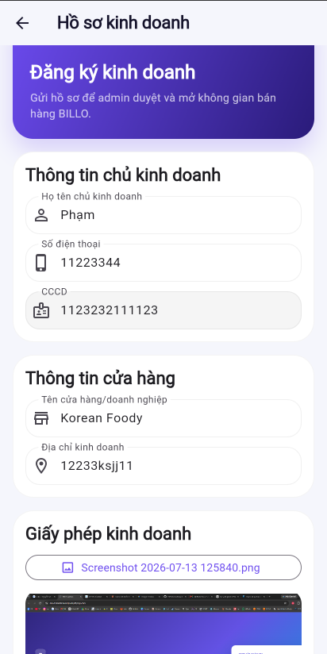
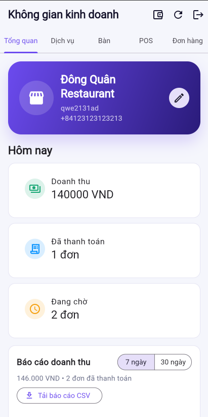
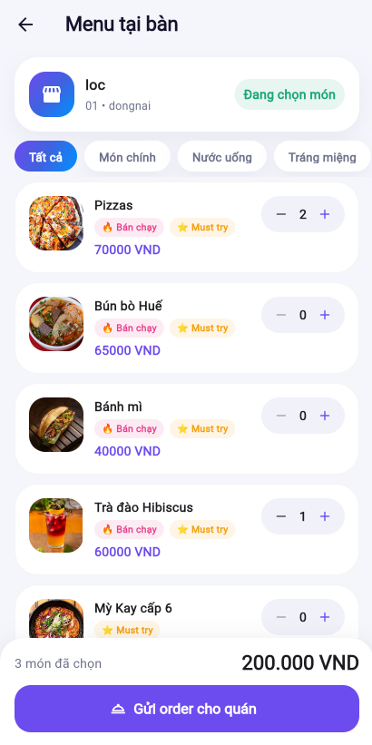
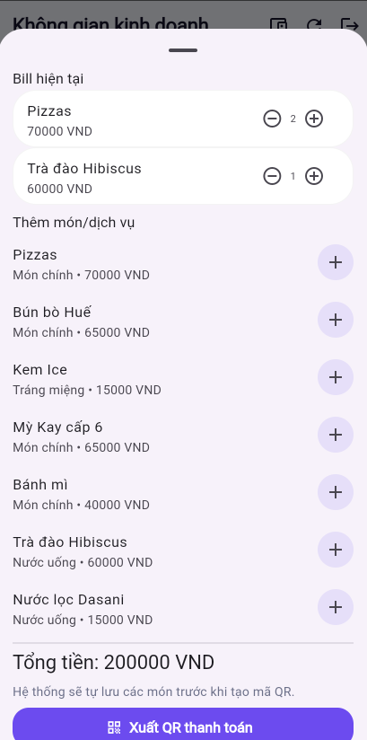
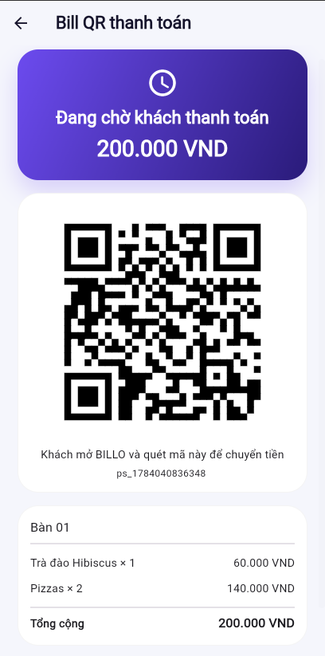
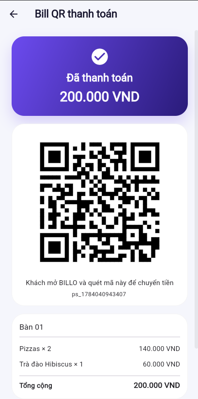
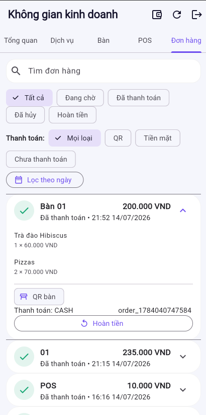
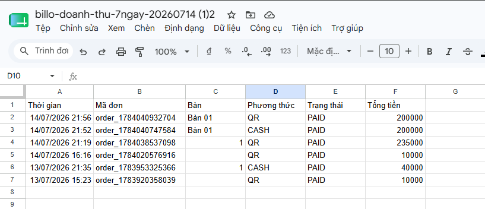

---

This section describes in detail each functionality designed for the Merchant role in AWS BILLO, complete with actual operational steps, expected results, and illustrative screenshots from the deployed demo at https://dev.d28z1hw6wfvjzy.amplifyapp.com.

A Merchant is a Customer whose business profile has been reviewed and approved by the Admin, thereby granting them store management privileges. A Merchant account still retains all Customer functionalities; details can be found in Section 7 of 5.9.1.

---

## 1. Business Registration

From a Customer account, the user submits a business registration profile to apply for the Merchant role.

Operational steps:

- Log in using a Customer account.
- Go to the **Cá nhân** (Profile) tab and select **Đăng ký kinh doanh** (Business Registration).
- Enter the required information:
  - Full name of the business owner.
  - Store/business name.
  - Contact phone number.
  - Citizen ID (CCCD).
  - Business address.
  - Business license image.
- Upload the business license photo.
- Submit the profile for review.

Image: Business Registration Form

Expected results:

- The app requests a pre-signed URL from the backend to upload the photo.
- The image is securely stored in Amazon S3.
- The registration profile is saved in DynamoDB with a `PENDING` status.
- The profile appears in the Admin's pending review list.
- The user awaits Admin review and does not yet have Merchant privileges at this stage.

Related components: Amazon S3 (document upload via pre-signed URLs), DynamoDB Main Table.

---

## 2. Business Workspace

Once the Admin approves the profile, the Merchant gains access to their dedicated store management area.

Operational steps:

- After approval, log out and log back in (allowing the app to pick up the updated Cognito group).
- Access the Merchant interface / **Không gian kinh doanh** (Business Workspace).
- Verify the displayed tabs: Overview, Services, Tables, POS, Orders.

Image: Business Workspace Interface

Expected results:

- The user is successfully assigned to the Cognito group `Merchant`.
- A store record is automatically provisioned for the Merchant.
- The Merchant dashboard becomes fully visible with all 5 management tabs.
- If the Merchant interface is not visible, logging out and logging back in will force the app to reload the group claims.

Related components: Cognito User Group `Merchant`, DynamoDB Main Table (store).

### 2.1. Update Store Information

Within the Overview tab, the Merchant can update:

- Store name.
- Address.
- Store avatar/cover photo.
- Operational status (On/Off).

Image: Update Store Information

Expected results: Store updates are saved directly to DynamoDB and instantly reflected on the Customer-facing menu. If the Merchant turns off the operational status, Customers will be blocked from placing orders even if they scan the correct table QR code.

### 2.2. Toggle Between Merchant ↔ Customer Interfaces

A Merchant account can seamlessly switch back and forth between the business workspace and the user wallet (Customer) interface within the same account. Switching in either direction strictly requires transaction PIN authentication; if a PIN has not been configured yet, the system forces the user to create one before allowing the switch.

Image: Interface Toggle Button in the Business Workspace

Detailed operational steps for both directions (Merchant → Customer and Customer → Merchant) can be found in Section 7 of 5.9.1 - Customer Features.

---

## 3. Category and Product/Service Management

Merchants organize their menus by category, add new products/services, and configure special discounts.

Operational steps — creating a category:

- Navigate to the **Dịch vụ** (Services) tab.
- Create a new category, for example: Bubble Tea, Beverages, Snacks.

Operational steps — adding products/services:

- Add a new item/service with: name, price, photo, and category.
- Mark as "Best seller" or "Must try" if applicable.
- Select the availability status: active or hidden.
- Save and verify that the item populates correctly on the customer menu.

Operational steps — configuring discounts:

- Edit the specific item/service to apply a discount.
- Enter the original price, discounted price, and the displayed discount percentage.
- Set up the start/end time, or specific hours/days of the week for the discount to apply.
- Save the changes.

Image: Product/Service List

Image: Product Discount Configuration

Expected results:

- Categories and products are stored in DynamoDB, and product images are uploaded to S3 via pre-signed URLs.
- Hidden products are omitted from the Customer menu.
- During the discount window, Customers see the correct markdown price and discount percentage; once the window expires, the price automatically reverts to the original baseline.

Related components: DynamoDB Main Table, Amazon S3 (product images).

---

## 4. Table and Table-QR Management

The Merchant creates virtual tables for the shop, and the system dynamically generates a unique QR code for each table.

Operational steps:

- Go to the **Bàn** (Tables) tab and click **Thêm bàn** (Add Table).
- Input the table name/number and zone/floor if applicable.
- The system automatically generates a dedicated QR code for the newly created table.
- Click on a table to view its details: table QR code, live order, and items ordered by customers.
- Download the table QR code, print it out, and place it on the physical table for Customers to scan.

Image: Table and Table-QR Management

Expected results:

- Table records are saved in DynamoDB.
- The generated QR code can be scanned by Customers to instantly pull up the shop's menu tied specifically to that table.
- Deleting a table with an ongoing order must be handled gracefully (the system should show a warning or block deletion if the table has an open bill).

Related components: DynamoDB Main Table (table).

---

## 5. Order Receiving and Bill Processing

The Merchant monitors incoming orders for each table and can modify the bill details prior to final settlement. The order list is updated near real-time through app-side API calling and manual refresh/polling, without using real-time persistent connections like WebSockets.

Operational steps:

- A Customer scans the table QR code and submits an order.
- The Merchant opens the **Bàn** (Tables) tab and clicks on the respective table.
- Review the pending order: items, quantities, and estimated total amount.
- If necessary, the Merchant can:
  - Add items (if the customer orders verbally).
  - Remove items (if the customer changes their mind).
  - Adjust item quantities.
  - Save the updated bill.

Image: Customer Ordering (Customer Interface)

Image: Order Displayed on the Merchant Interface

Expected results:

- New orders from Customers populate on the Merchant dashboard after refreshing the order list.
- The bill accurately reflects the current items, quantities, and subtotal.
- Any modifications to the bill (add/remove/edit) are saved before generating a payment QR code, ensuring the QR code matches the final aggregate cost.

Related components: DynamoDB Main Table (order, bill).

---

## 6. Payment Processing

Merchants have two available settlement workflows to close out an order: QR/Wallet payment or Cash payment.

### 6.1. QR / Wallet Payment

Operational steps:

- Within the table details or order screen, click **Tạo QR thanh toán** (Generate Payment QR).
- Present the QR code to the Customer to scan via their app.
- The Customer authorizes the transfer by entering their transaction PIN.
- The Merchant monitors the order status until it updates to paid.

Image: Generate Payment QR

Image: Order Status Transited to Paid

### 6.2. Cash Payment

Operational steps:

- The Merchant selects the cash payment option.
- The order is manually flagged as paid in the system.
- The table status reverts to vacant, becoming available for the next group of customers.

Image: Cash Payment Processing

Expected results:

- For QR payments: The backend initiates a payment session, the Customer's wallet balance is debited, the Merchant's wallet is credited, transaction records are generated for both accounts, and the payment session is marked as completed.
- Previously generated payment QRs become invalid if the underlying bill is altered — the Merchant must generate a fresh QR code.
- Upon successful payment (either QR or cash), the table is cleared and the active table association is removed from the Customer's session.

Related components: DynamoDB (payment session, transaction); Merchant wallet updates.

---

## 7. Export CSV Reports

Merchants can export all orders and transactions into a CSV file, useful for revenue reconciliation, auditing, or accounting without relying on manual app lookups.

Operational steps:

- Navigate to the **Tổng quan** (Overview) tab.
- Click the download CSV report button.
- The CSV file downloads directly to the local device.

Image: Download CSV Report Button

Image: Order Report CSV File

Column descriptions:

- **Thời gian** (Timestamp): The exact time the order was created/settled.
- **Mã đơn** (Order ID): The unique identifier of the order inside DynamoDB.
- **Bàn** (Table): The table number where the order originated; left blank if the order is not tied to a table (e.g., a direct Merchant-generated payment QR).
- **Phương thức** (Method): `QR` (e-wallet transfer) or `CASH` (physical cash).
- **Trạng thái** (Status): The payment state of the order, such as `PAID`.
- **Tổng tiền** (Total Amount): The total value of the order, denominated in VND.

Expected results:

- The CSV file contains a complete list of orders based on the time and status filters currently applied.
- Data inside the CSV perfectly mirrors the corresponding `order`/`transaction` records in the DynamoDB Main Table.
- Merchants can open the file using Excel or Google Sheets to easily aggregate revenue metrics by day, table, or payment type.

Related components: DynamoDB Main Table (order, transaction), AWS Lambda (querying and CSV file generation).

---

## Troubleshooting / Common Errors

| Scenario | Possible Cause |
|---|---|
| Merchant privileges fail to appear post-approval | The user has not logged out and back in to refresh the Cognito session claims |
| Product or business license photos fail to upload | S3 bucket permission block, pre-signed URL generation failure, or invalid file type/size |
| Payment QR code is invalid/unusable | The bill was modified after the QR was rendered, or the payment session window timed out |
| Customer orders do not appear on the Merchant UI | Order list hasn't been refreshed, or API Gateway/Lambda connection drop — inspect CloudWatch Logs |
| Unable to switch between the Customer and Merchant interfaces | A transaction PIN has not been set up, or the wrong PIN was entered during the transition gate |
| Exported CSV file has missing orders or incorrect data | Active time/status filter constraints, or DynamoDB data out of sync |

---

## General Expected Outcome

Upon completing this section, core functionalities for the Merchant role have been thoroughly verified: business registration, store/product/discount management, Merchant/Customer dashboard toggling, table and table-QR configuration, order/bill processing, payment acceptance via QR or cash, and CSV report exporting — all working properly on the deployed live demo.