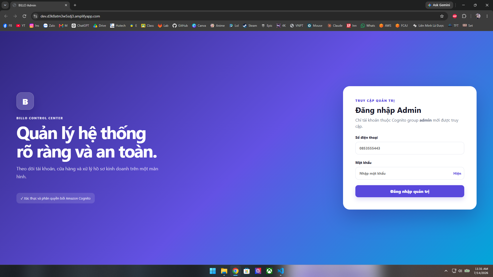
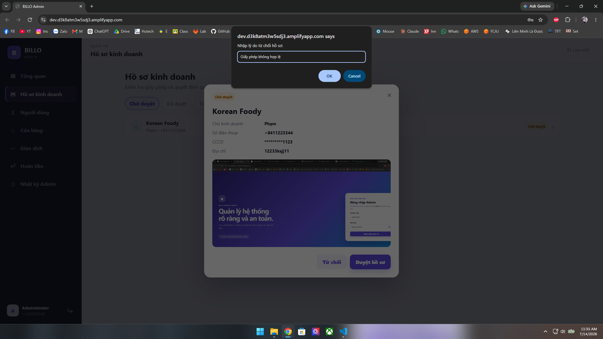
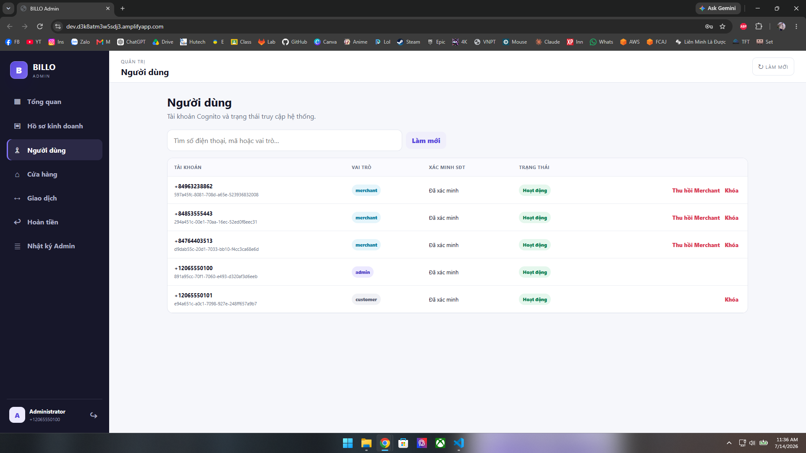
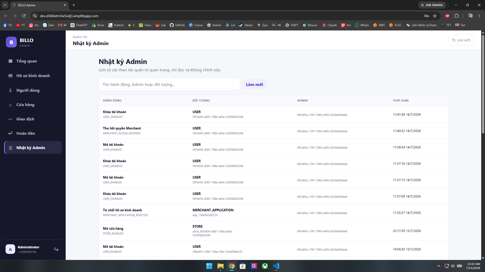
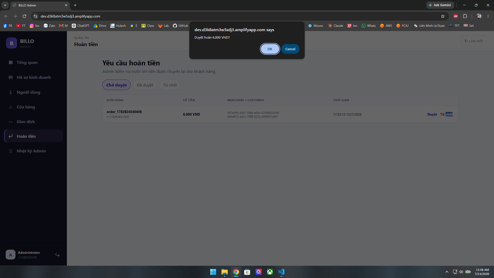

---

Phần này trình bày chi tiết từng chức năng dành cho vai trò Admin trong AWS BILLO, kèm bước thao tác thực tế, kết quả mong đợi và ảnh minh họa từ bản demo đã deploy tại https://dev.d3k8atm3w5sdj3.amplifyapp.com

Admin là vai trò vận hành hệ thống: duyệt hồ sơ Merchant, quản lý user/cửa hàng, theo dõi hoạt động và xử lý hoàn tiền.

---

## 1. Đăng nhập Admin

Chỉ tài khoản thuộc Cognito group `Admin` mới truy cập được Admin Web.

Các bước thao tác:

- Mở Admin Web tại https://dev.d3k8atm3w5sdj3.amplifyapp.com.
- Nhập số điện thoại và mật khẩu của tài khoản Admin.
- Bấm Đăng nhập quản trị.

Ảnh: Màn hình đăng nhập Admin

Kết quả mong đợi:

- Nếu tài khoản thuộc group `Admin`: đăng nhập thành công, vào thẳng dashboard quản trị.
- Nếu tài khoản không thuộc group `Admin` (kể cả Customer/Merchant hợp lệ): bị từ chối truy cập.
- Nếu đăng nhập thất bại, cần kiểm tra: thông tin tài khoản, cấu hình Cognito User Pool, JWT token, lỗi trong browser console, CloudWatch Logs của backend.

Chức năng liên quan: Amazon Cognito (User Group `Admin`).

---

## 2. Dashboard tổng quan

Sau khi đăng nhập, Admin thấy ngay tình trạng vận hành hệ thống.

Các bước thao tác:

- Xem các chỉ số hiển thị trên dashboard:
  - Số hồ sơ Merchant đang chờ duyệt.
  - Số cửa hàng.
  - Số user.
  - Giao dịch gần đây.
  - Hoàn tiền chờ xử lý.
  - Trạng thái vận hành: hồ sơ chờ duyệt, cửa hàng bị tắt, tài khoản bị khóa.

Ảnh: Dashboard tổng quan Admin

Kết quả mong đợi:

- Các số liệu trên dashboard khớp với dữ liệu thực tế trong DynamoDB.
- Admin có thể dùng dashboard để phát hiện nhanh các việc cần xử lý (hồ sơ chờ duyệt, hoàn tiền chờ xử lý) mà không cần vào từng mục riêng lẻ.
- Log kỹ thuật chi tiết (Lambda, API) không hiển thị ở đây — Admin Web chỉ hiển thị dữ liệu nghiệp vụ, log kỹ thuật vẫn xem ở AWS CloudWatch.

Chức năng liên quan: DynamoDB Main Table.

---

## 3. Duyệt / Từ chối hồ sơ Merchant

Admin xét duyệt các hồ sơ đăng ký kinh doanh do Customer gửi lên.

Các bước thao tác — xem hồ sơ:

- Vào mục hồ sơ Merchant.
- Chọn hồ sơ đang ở trạng thái `PENDING`.
- Xem chi tiết: chủ kinh doanh, tên cửa hàng, CCCD, số điện thoại, ảnh giấy phép kinh doanh.

Các bước thao tác — duyệt hồ sơ:

- Bấm Duyệt.

Các bước thao tác — từ chối hồ sơ:

- Bấm Từ chối.
- Nhập lý do từ chối nếu có.

Ảnh: Duyệt hồ sơ đăng ký Merchant

Kết quả mong đợi khi Duyệt:

- Trạng thái hồ sơ chuyển thành `APPROVED`.
- User được thêm vào group `Merchant` trong Cognito.
- Store record được tạo cho Merchant.
- Merchant cần đăng nhập lại trên Flutter app để thấy giao diện kinh doanh.

Kết quả mong đợi khi Từ chối:

- Trạng thái hồ sơ chuyển thành `REJECTED`.
- User không được thêm vào group `Merchant`, không có quyền truy cập chức năng kinh doanh.

Chức năng liên quan: Amazon Cognito (User Group `Merchant`), DynamoDB Main Table.

---

## 4. Quản lý người dùng và cửa hàng

Admin theo dõi và can thiệp vào tài khoản user cũng như trạng thái hoạt động của cửa hàng.

Ảnh: Danh sách quản lý người dùng và cửa hàng

### 4.1. Khóa / mở khóa tài khoản

Các bước thao tác:

- Vào danh sách user.
- Kiểm tra thông tin và vai trò hiện tại (customer/merchant/admin).
- Khóa/mở khóa tài khoản nếu chức năng đã bật.

Ảnh: Khóa/mở khóa tài khoản người dùng

Ảnh: Giao diện người dùng sau khi bị khóa

Kết quả mong đợi:

- Khi Admin khóa tài khoản, user vẫn đăng nhập được bình thường (Cognito login không bị vô hiệu hóa), nhưng các chức năng nghiệp vụ (chuyển tiền, đặt món, thanh toán...) đều bị chặn.
- Tài khoản bị khóa hiển thị thông báo yêu cầu liên hệ CSKH/Admin, cho đến khi Admin mở khóa lại.
- Mở khóa: tài khoản được khôi phục đầy đủ chức năng ngay lập tức.

### 4.2. Thu hồi quyền Merchant

Các bước thao tác:

- Vào user/merchant cần thu hồi quyền.
- Bấm Thu hồi quyền merchant.

Ảnh: Thu hồi quyền Merchant

Kết quả mong đợi:

- User bị xóa khỏi group `Merchant` trong Cognito.
- Profile chuyển về customer.
- Cửa hàng tương ứng bị tắt hoạt động.
- Lịch sử giao dịch được giữ lại nguyên vẹn, không bị xóa.
- Hệ thống ghi lại audit log cho hành động thu hồi.

### 4.3. Quản lý cửa hàng

Các bước thao tác:

- Vào danh sách cửa hàng.
- Xem trạng thái từng cửa hàng.
- Bật/tắt trạng thái hoạt động nếu cần.

Kết quả mong đợi: khi cửa hàng bị tắt (inactive), Customer không đặt món được nữa dù QR bàn vẫn quét được.

Chức năng liên quan: Amazon Cognito (User Group), DynamoDB Main Table.

---

## 5. Admin logs và hoàn tiền

Admin logs theo dõi toàn bộ hoạt động của hệ thống, và xử lý các yêu cầu hoàn tiền.

### 5.1. Xem Admin logs

Các bước thao tác:

- Vào mục "Nhật ký Admin".
- Xem danh sách chi tiết hành động, đối tượng và ngày tháng năm.

Ảnh: Nhật ký hoạt động Admin

### 5.2. Xử lý hoàn tiền

Các bước thao tác:

- Vào mục "Hoàn tiền".
- Xem yêu cầu hoàn tiền đang chờ xử lý.
- Duyệt hoặc từ chối yêu cầu.

Ảnh: Xử lý yêu cầu hoàn tiền

Kết quả mong đợi khi Duyệt hoàn tiền:

- Hệ thống trừ tiền từ ví Merchant.
- Cộng lại tiền vào ví Customer.
- Cập nhật trạng thái đơn/giao dịch liên quan sang đã hoàn tiền.
- Duyệt 2 lần liên tiếp cho cùng một yêu cầu không được phép gây hoàn tiền 2 lần.

Kết quả mong đợi khi Từ chối hoàn tiền: không có tiền nào bị di chuyển giữa các ví, trạng thái yêu cầu được cập nhật là bị từ chối.

Chức năng liên quan: DynamoDB Main Table (transaction, refund).

---

## Lỗi thường gặp

| Tình huống | Nguyên nhân có thể |
|---|---|
| Đăng nhập Admin thất bại | Sai thông tin tài khoản, user không thuộc group `Admin`, cấu hình Cognito/API sai |
| Trạng thái hồ sơ Merchant không cập nhật | Lỗi request API Gateway, lỗi Lambda, quyền cập nhật Cognito group chưa đủ |
| Số liệu dashboard không khớp thực tế | Dữ liệu DynamoDB chưa đồng bộ, cần kiểm tra Lambda logs trong CloudWatch |
| Tài khoản đã khóa vẫn dùng được chức năng | Lỗi kiểm tra trạng thái khóa ở phía backend/Lambda, cần kiểm tra CloudWatch Logs |
| Hoàn tiền không cập nhật đúng số dư | Lỗi DynamoDB transaction, cần kiểm tra CloudWatch Logs |

---

## Kết quả mong đợi chung

Sau khi hoàn thành phần này, các chức năng chính của vai trò Admin đã được kiểm tra đầy đủ: đăng nhập, theo dõi dashboard, duyệt/từ chối hồ sơ Merchant, quản lý user và cửa hàng (bao gồm behavior khóa tài khoản đúng thực tế), xem nhật ký hoạt động và xử lý hoàn tiền — tất cả hoạt động đúng trên bản demo đã deploy.